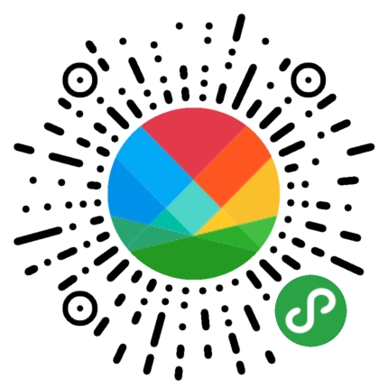

# 【洪谷山】每日分享

[ ](https://github.com/jingle1267/HelloCodeDev/issues)&nbsp;[](https://github.com/jingle1267/HelloCodeDev/blob/master/LICENSE)&nbsp;

微信小程序目前仅支持分享给好友，暂不支持直接分享到朋友圈。针对分享到朋友圈这个问题，通常的做法是生成一张海报图片然后把图片分享到朋友圈。朋友圈到我们的小程序，通过长按图片识别图中小程序码实现。

### 1. 基本介绍

本代码库是微信小程序的一个每日分享案例。每天会中英文美句，推荐给大家，可以点击保存图片到本地，然后分享到朋友圈（小程序暂不支持直接分享到朋友圈）。主要用到的技术点就是 canvas 画图。



欢迎微信扫码体验，有任何问题可以提意见反馈。谢谢！

效果图如下：

如果对小程序不太了解的话，可以先看我的小程序入门介绍：http://ihongqiqu.com/2018/01/10/weixin-app/

### 2. 遇到的问题

本小程序开发中，逻辑并不复杂。相对难处理一点就是中英文换行的问题。针对中英文换行的问题，我实现了一下换行逻辑，代码如下：

```javascript
  /**
   * 文本转换为数组，数组里面分别是每行的文本内容，支持英文分行
   * 
   * ctx Context
   * txt 待换行的文本
   * width 需要显示文本的最大宽度
   * isEng 是否是英文
   */
  txt2arr: function (ctx, txt, width, isEng) {
    var chr = txt.split(isEng ? " " : "");
    var temp = "";
    var row = [];

    for (var i = 0; i < chr.length; i++) {
      var cur = chr[i];
      var tempWidth = ctx.measureText(temp).width;
      var curWidth = ctx.measureText(cur).width;
      // 需要考虑英文换行问题
      if (tempWidth + curWidth < width) {
        temp += cur;
        temp += (isEng ? " " : "");
      } else {
        row.push(temp);
        temp = "";
        temp += cur;
        temp += (isEng ? " " : "");
      }
    }

    row.push(temp);
    return row;
  }
```

上面方法是把字符串处理为字符串数组，数组每个值代表一行，这里是换行核心逻辑，但不是全部逻辑，全部逻辑见核心代码调用。

### 3. 核心代码

核心的 canvas 画图逻辑代码如下：

```javascript
  drawShare: function (imgPath, sRes) {
    var ctx = wx.createContext()
    var screenWidth = wx.getSystemInfoSync().windowWidth
    var screenHeight = wx.getSystemInfoSync().screenHeight
    // 小程序码宽度
    var qrWidth = 80
    // 小程序码边距
    var qrMargin = screenHeight * 0.02
    // 小程序码路径
    var qrPath = '../../img/ic_wx_mini.jpg'

    // 画背景图
    // ctx.drawImage(this.data.background, 0, 0, screenWidth, screenHeight - 30)
    // ctx.save()

    // 画白色背景
    ctx.setFillStyle("#FFFFFF")
    ctx.fillRect(0, 0, screenWidth, screenHeight)
    ctx.save()

    // 画右上角几何图形
    ctx.setLineWidth(1)
    ctx.setStrokeStyle("#079dd8")
    ctx.setFillStyle("#079dd8")
    ctx.beginPath()
    ctx.moveTo(screenWidth * 100 / 640, 0)
    ctx.lineTo(screenWidth - screenWidth * 100 / 640, screenHeight * 140 / 1000)
    ctx.lineTo(screenWidth, screenHeight * 110 / 1000)
    ctx.lineTo(screenWidth, 0)
    ctx.fill()
    ctx.stroke()
    ctx.closePath()
    ctx.save()

    // 画日期
    var date = new Date()
    ctx.setFontSize(40)
    ctx.setFillStyle("#FF8700")
    ctx.fillText('' + date.getDate(), 15, 65)
    ctx.setFontSize(20)
    ctx.fillText('' + (date.getMonth() + 1) + '.' + date.getFullYear(), 70, 65)
    ctx.save()

    // 画每日一句-英文
    ctx.setFontSize(22)
    ctx.setFillStyle("#BBBBBB")
    console.log("shareRes : " + sRes);
    var arr = this.txt2arr(ctx, sRes.content, screenWidth * 0.9, true)
    // console.log(arr)
    for (var i = 0; i < arr.length; i++) {
      ctx.fillText('' + arr[i], 15, screenHeight * 145 / 1000 + (i + 1) * 24)
    }
    ctx.save()

    // 画每日一句-中文
    ctx.setFontSize(14)
    ctx.setFillStyle("#7D7D7D")
    // ctx.fillText(sRes.note, 15, screenHeight * 375 / 1000)
    var arrZH = this.txt2arr(ctx, sRes.note, screenWidth * 0.9, false)
    // console.log(arrCH)
    for (var k = 0; k < arrZH.length; k++) {
      ctx.fillText('' + arrZH[k], 15, screenHeight * 345 / 1000 + (k + 1) * 16)
    }
    ctx.save()

    // 画配图
    var picY = screenHeight * 0.4
    var picHeight = screenWidth * 580 / 938
    ctx.drawImage(this.data.background, 0, picY, screenWidth, picHeight)
    ctx.save()

    // 画渐变
    var grd = ctx.createLinearGradient(screenWidth / 2, picY - 2, screenWidth / 2, picY * 1.3);
    grd.addColorStop(0, 'rgba(255, 255, 255, 1)')
    grd.addColorStop(1, 'rgba(255, 255, 255, 0)')
    ctx.setFillStyle(grd)
    ctx.fillRect(0, picY - 2, screenWidth, picHeight / 3)
    ctx.save()

    // 画底部梯形
    var blueHeight = picY + picHeight;
    ctx.setLineWidth(5)
    ctx.setStrokeStyle("#079dd8")
    ctx.setFillStyle("#079dd8")
    ctx.beginPath()
    ctx.moveTo(0, blueHeight - screenWidth * 70 / 640)
    ctx.lineTo(screenWidth, blueHeight)
    ctx.lineTo(screenWidth, screenHeight)
    ctx.lineTo(0, screenHeight)
    ctx.lineTo(0, blueHeight - screenWidth * 70 / 640)
    ctx.fill()
    ctx.stroke()
    ctx.closePath()
    ctx.save()

    // 画小编的话
    ctx.setFontSize(12)
    ctx.setFillStyle("#FFFFFF")
    var arr2 = this.txt2arr(ctx, sRes.translation, screenWidth * 0.6)
    console.log(arr)
    var startHeight = blueHeight * 1.04
    for (var j = 0; j < arr2.length; j++) {
      ctx.fillText('' + arr2[j], 15, startHeight + j * 18)
    }
    ctx.save()

    // 画小程序码
    ctx.setLineWidth(1)
    ctx.beginPath()
    ctx.arc(screenWidth - qrWidth / 2 - qrMargin, screenHeight - qrWidth / 2 - qrMargin, qrWidth / 2, 0, 2 * Math.PI)
    ctx.setStrokeStyle("#ffff00")
    ctx.stroke()
    ctx.clip()
    ctx.drawImage(qrPath, screenWidth - qrWidth - qrMargin, screenHeight - qrWidth - qrMargin, qrWidth, qrWidth)
    ctx.save()

    wx.drawCanvas({
      canvasId: 'canvas',
      actions: ctx.getActions()
    })
  }
```

有任何问题欢迎留言反馈。
